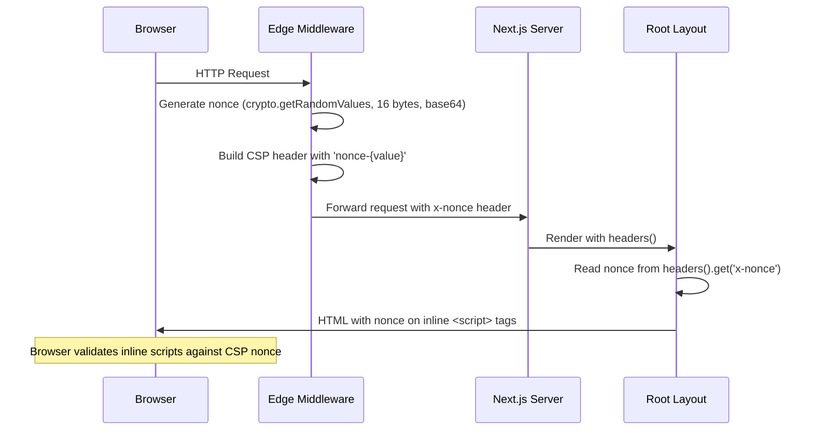

# Design Document: ARL Refactor & CSP Nonce

## Overview

This design covers two coupled improvements to The Hub's franchise management dashboard:

1. **ARL Page Refactor**: Decompose the monolithic `src/app/arl/page.tsx` (~1100 lines, 15 views via `activeView` state) into a Next.js App Router layout with nested route segments. Shared state (socket handlers, meeting/broadcast state, online counts, notifications, swipe navigation) moves into a new `ArlDashboardContext` provided by `src/app/arl/layout.tsx`. Each view becomes its own route page (e.g., `/arl/messages` → `src/app/arl/messages/page.tsx`). The sidebar, header, overlays, and toasts remain in the layout. URL-based navigation replaces `sessionStorage` persistence, and browser back/forward works naturally.

2. **CSP Nonce Implementation**: Replace `'unsafe-inline'` in the Content-Security-Policy header with per-request cryptographic nonces. The Edge middleware (`src/middleware.ts`) generates a nonce, sets it in the CSP header and an `x-nonce` response header. The root layout reads the nonce from request headers and propagates it to inline `<script>` tags. The static CSP definition in `next.config.ts` is removed so middleware is the single source of truth. Sentry SDK receives the nonce for its dynamically injected scripts.

### Key Design Decisions

- **Layout-level context over page-level state**: Moving shared state to `layout.tsx` avoids re-mounting socket listeners on every route transition. The layout persists across child route changes in Next.js App Router.
- **`usePathname()` over `activeView` state**: The active view is derived from the URL, eliminating state synchronization bugs and enabling deep linking.
- **Edge middleware for CSP**: Generating nonces in middleware (Edge runtime) ensures every response gets a unique nonce before reaching the client, including SSR responses. The `crypto.getRandomValues` API is available in Edge runtime.
- **`x-nonce` header propagation**: Next.js server components can read request headers via `headers()`. Passing the nonce as a custom header avoids needing to thread it through the custom server.

## Architecture

### ARL Refactor Architecture

```mermaid
graph TD
    subgraph "src/app/arl/layout.tsx"
        ArlLayout["ArlLayout (layout.tsx)"]
        ArlDashCtx["ArlDashboardProvider"]
        Sidebar["ArlSidebar"]
        Header["Header Bar"]
        PageInd["PageIndicator (mobile)"]
        Overlays["BroadcastStudio / MeetingRoom / Toasts"]
    end

    subgraph "Nested Route Pages"
        Overview["arl/page.tsx (overview)"]
        Messages["arl/messages/page.tsx"]
        Tasks["arl/tasks/page.tsx"]
        Calendar["arl/calendar/page.tsx"]
        Locations["arl/locations/page.tsx"]
        Forms["arl/forms/page.tsx"]
        Emergency["arl/emergency/page.tsx"]
        Users["arl/users/page.tsx"]
        Leaderboard["arl/leaderboard/page.tsx"]
        Remote["arl/remote/page.tsx"]
        DataMgmt["arl/data-management/page.tsx"]
        Broadcast["arl/broadcast/page.tsx"]
        Meetings["arl/meetings/page.tsx"]
        Analytics["arl/analytics/page.tsx"]
        TenantSettings["arl/tenant-settings/page.tsx"]
    end

    ArlLayout --> ArlDashCtx
    ArlDashCtx --> Sidebar
    ArlDashCtx --> Header
    ArlDashCtx --> PageInd
    ArlDashCtx --> Overlays
    ArlLayout -->|"children"| Overview
    ArlLayout -->|"children"| Messages
    ArlLayout -->|"children"| Tasks
    ArlLayout -->|"children"| Calendar
    ArlLayout -->|"children"| Locations
    ArlLayout -->|"children"| Forms
    ArlLayout -->|"children"| Emergency
    ArlLayout -->|"children"| Users
    ArlLayout -->|"children"| Leaderboard
    ArlLayout -->|"children"| Remote
    ArlLayout -->|"children"| DataMgmt
    ArlLayout -->|"children"| Broadcast
    ArlLayout -->|"children"| Meetings
    ArlLayout -->|"children"| Analytics
    ArlLayout -->|"children"| TenantSettings
```



### CSP Nonce Flow



## Components and Interfaces

### ArlDashboardContext

```typescript
// src/lib/arl-dashboard-context.tsx

interface ArlDashboardContextValue {
  // Navigation
  activeView: ArlView;
  navigateToView: (view: ArlView) => void;
  swipeDirection: 1 | -1;

  // Counts & badges
  unreadCount: number;
  onlineCount: number;

  // Meeting state
  activeMeetings: ActiveMeeting[];
  joiningMeeting: { meetingId: string; title: string } | null;
  setJoiningMeeting: (m: { meetingId: string; title: string } | null) => void;

  // Broadcast state
  activeBroadcast: ActiveBroadcast | null;
  watchingBroadcast: boolean;
  setWatchingBroadcast: (v: boolean) => void;
  showBroadcastNotification: boolean;
  setShowBroadcastNotification: (v: boolean) => void;

  // Notifications
  notificationPermission: NotificationPermission;
  pushSubscription: PushSubscription | null;
  requestNotificationPermission: () => Promise<void>;

  // UI state
  sidebarOpen: boolean;
  setSidebarOpen: (v: boolean) => void;
  isMobileOrTablet: boolean;
  device: DeviceType;

  // Toasts
  toasts: TaskToast[];
  notifToast: { msg: string; type: "success" | "error" } | null;
}

type ArlView =
  | "overview" | "messages" | "tasks" | "calendar"
  | "locations" | "forms" | "emergency" | "users"
  | "leaderboard" | "remote" | "data-management"
  | "broadcast" | "meetings" | "analytics" | "tenant-settings";

interface ActiveMeeting {
  meetingId: string;
  title: string;
  hostName: string;
  hostId: string;
}

interface ActiveBroadcast {
  broadcastId: string;
  arlName: string;
  title: string;
}

interface TaskToast {
  id: string;
  locationName: string;
  taskTitle: string;
  pointsEarned: number;
}
```

### ARL Layout (`src/app/arl/layout.tsx`)

The layout component:
- Wraps children in `ArlDashboardProvider`
- Renders `ArlSidebar`, header bar, `PageIndicator`, overlay components (BroadcastStudio, MeetingRoom), and toast containers
- Derives `activeView` from `usePathname()` by mapping `/arl/{segment}` to the view ID
- Registers all socket event listeners (`task:completed`, `presence:update`, `meeting:started`, `meeting:ended`, `meeting:list`, `message:new`, `conversation:updated`, `message:read`)
- Fetches initial online count from `/api/locations` and unread count from `/api/messages` on mount
- Provides `navigateToView()` that calls `router.push('/arl/{view}')` with direction tracking
- Wraps `{children}` in `AnimatePresence` with the existing spring transition (stiffness 300, damping 30)
- Attaches `useSwipeNavigation` hook for mobile gesture navigation

### Modified ArlSidebar

The existing `ArlSidebar` component changes minimally:
- `onViewChange` prop now calls `navigateToView()` from context instead of `setActiveView()`
- `activeView` prop is derived from URL pathname in the layout
- Permission filtering logic remains unchanged

### Route Pages

Each view becomes a thin page component that imports the existing component:

```typescript
// Example: src/app/arl/messages/page.tsx
"use client";
import { Messaging } from "@/components/arl/messaging";

export default function MessagesPage() {
  return (
    <div className="flex flex-col flex-1 min-h-0 overscroll-contain p-4">
      <Messaging />
    </div>
  );
}
```

The `broadcast` route page renders `BroadcastStudio` inline (not as an overlay) since it takes over the full viewport. The `meetings` route page includes the active meetings list, `ScheduledMeetings`, and `MeetingAnalyticsDashboard` (currently inline in `page.tsx`). The `calendar` route page includes the `ArlCalendar` component (currently defined inline in `page.tsx` — it will be extracted to `src/components/arl/arl-calendar.tsx`).

### View-to-Route Mapping

| View ID | Route | Page File |
|---------|-------|-----------|
| overview | `/arl` | `src/app/arl/page.tsx` |
| messages | `/arl/messages` | `src/app/arl/messages/page.tsx` |
| tasks | `/arl/tasks` | `src/app/arl/tasks/page.tsx` |
| calendar | `/arl/calendar` | `src/app/arl/calendar/page.tsx` |
| locations | `/arl/locations` | `src/app/arl/locations/page.tsx` |
| forms | `/arl/forms` | `src/app/arl/forms/page.tsx` |
| emergency | `/arl/emergency` | `src/app/arl/emergency/page.tsx` |
| users | `/arl/users` | `src/app/arl/users/page.tsx` |
| leaderboard | `/arl/leaderboard` | `src/app/arl/leaderboard/page.tsx` |
| remote | `/arl/remote` | `src/app/arl/remote/page.tsx` |
| data-management | `/arl/data-management` | `src/app/arl/data-management/page.tsx` |
| broadcast | `/arl/broadcast` | `src/app/arl/broadcast/page.tsx` |
| meetings | `/arl/meetings` | `src/app/arl/meetings/page.tsx` |
| analytics | `/arl/analytics` | `src/app/arl/analytics/page.tsx` |
| tenant-settings | `/arl/tenant-settings` | `src/app/arl/tenant-settings/page.tsx` |

### CSP Middleware Changes (`src/middleware.ts`)

```typescript
// Added to the existing middleware function:

function generateNonce(): string {
  const bytes = new Uint8Array(16);
  crypto.getRandomValues(bytes);
  return btoa(String.fromCharCode(...bytes));
}

// Inside middleware():
const nonce = generateNonce();
const cspHeader = [
  "default-src 'self'",
  `script-src 'self' 'nonce-${nonce}' https://*.sentry.io`,
  `style-src 'self' 'nonce-${nonce}' https://fonts.googleapis.com`,
  "font-src 'self' https://fonts.gstatic.com",
  "img-src 'self' data: blob:",
  "media-src 'self' blob:",
  "connect-src 'self' wss: ws: https://*.meetthehub.com https://*.meethehub.com https://*.sentry.io https://*.ingest.sentry.io",
  "frame-src 'self'",
  "worker-src 'self' blob:",
  "object-src 'none'",
  "base-uri 'self'",
  "form-action 'self'",
  "upgrade-insecure-requests",
].join("; ");

// Set on response:
response.headers.set("Content-Security-Policy", cspHeader);
response.headers.set("x-nonce", nonce);
```

### Root Layout Nonce Propagation (`src/app/layout.tsx`)

```typescript
// Convert to async server component to read headers
import { headers } from "next/headers";

export default async function RootLayout({ children }: { children: React.ReactNode }) {
  const headersList = await headers();
  const nonce = headersList.get("x-nonce") ?? "";

  return (
    <html lang="en" suppressHydrationWarning>
      <head>
        <meta name="apple-mobile-web-app-title" content="The Hub" />
      </head>
      <body className={`${inter.variable} antialiased`}>
        <script nonce={nonce} dangerouslySetInnerHTML={{ __html: `...iOS Safari pinch-to-zoom block...` }} />
        {/* Pass nonce to providers that need it */}
        ...
      </body>
    </html>
  );
}
```

### Sentry Nonce Integration

The nonce is exposed to the client via a `<meta>` tag in the root layout:

```html
<meta name="csp-nonce" content="{nonce}" />
```

The Sentry client config reads it:

```typescript
// sentry.client.config.ts
const nonce = document.querySelector('meta[name="csp-nonce"]')?.getAttribute('content') || undefined;

Sentry.init({
  // ...existing config
  // Sentry's BrowserTracing and Replay integrations will use this nonce
  // for any inline scripts they inject
});
```

Note: Sentry's `@sentry/nextjs` SDK automatically picks up the nonce when it's set on the `<script>` tags rendered by Next.js. The meta tag approach is a fallback for any dynamically injected scripts.

### Permission-Based Route Guard

The `ArlDashboardProvider` in the layout checks permissions on route changes:

```typescript
// Inside ArlDashboardProvider
const pathname = usePathname();
const router = useRouter();
const { user } = useAuth();

useEffect(() => {
  const viewId = pathnameToViewId(pathname);
  const requiredPerm = VIEW_PERMISSIONS[viewId];
  if (requiredPerm && !hasPermission(user?.role, user?.permissions ?? null, requiredPerm)) {
    router.replace("/arl");
  }
}, [pathname, user]);
```

## Data Models

No new database tables or schema changes are required. The refactor is purely a frontend architecture change. The CSP nonce is ephemeral (generated per-request, never stored).

### Existing Data Dependencies

- **User permissions**: Stored in the `arls` table as a JSON column, parsed by `parsePermissions()`. Used by the layout for sidebar filtering and route guarding.
- **Socket events**: No schema changes. The same events (`task:completed`, `presence:update`, `meeting:started`, etc.) are consumed by the layout instead of the page.
- **Session storage**: The `arl-active-view` key in `sessionStorage` is removed. The URL is now the source of truth.

### View ID ↔ Pathname Mapping

```typescript
const VIEW_ROUTE_MAP: Record<ArlView, string> = {
  overview: "/arl",
  messages: "/arl/messages",
  tasks: "/arl/tasks",
  calendar: "/arl/calendar",
  locations: "/arl/locations",
  forms: "/arl/forms",
  emergency: "/arl/emergency",
  users: "/arl/users",
  leaderboard: "/arl/leaderboard",
  remote: "/arl/remote",
  "data-management": "/arl/data-management",
  broadcast: "/arl/broadcast",
  meetings: "/arl/meetings",
  analytics: "/arl/analytics",
  "tenant-settings": "/arl/tenant-settings",
};

function pathnameToViewId(pathname: string): ArlView {
  const segment = pathname.replace(/^\/arl\/?/, "").split("/")[0] || "overview";
  // Map segment back to view ID, defaulting to "overview"
  return (Object.keys(VIEW_ROUTE_MAP) as ArlView[]).find(
    (v) => VIEW_ROUTE_MAP[v] === `/arl/${segment}` || (v === "overview" && segment === "")
  ) ?? "overview";
}
```


## Correctness Properties

*A property is a characteristic or behavior that should hold true across all valid executions of a system — essentially, a formal statement about what the system should do. Properties serve as the bridge between human-readable specifications and machine-verifiable correctness guarantees.*

### Property 1: View ID ↔ Pathname Round-Trip

*For any* valid `ArlView` ID, mapping it to a route pathname via `VIEW_ROUTE_MAP` and then converting that pathname back to a view ID via `pathnameToViewId` should return the original view ID. Conversely, for any valid ARL pathname, converting to a view ID and back to a pathname should return the original pathname.

**Validates: Requirements 2.1, 2.4, 1.4**

### Property 2: Presence Delta-Update Correctness

*For any* sequence of `presence:update` socket events (each with a `userId`, `userType: "location"`, and `isOnline` boolean), the resulting `onlineCount` should equal the number of unique location user IDs whose most recent event had `isOnline: true`. Events with `userType` other than `"location"` should not affect the count.

**Validates: Requirements 1.6**

### Property 3: Task Completion Toast Content

*For any* `task:completed` socket event payload containing a `locationId`, `taskTitle`, and `pointsEarned`, the resulting toast object should contain the resolved location name (from the location names cache), the exact task title, and the exact points earned value.

**Validates: Requirements 1.7**

### Property 4: Slide Direction from Ordinal Position

*For any* pair of source and destination `ArlView` IDs where both exist in the `navItems` list, the computed slide direction should be `1` (right/forward) when the destination's index is greater than the source's index, and `-1` (left/backward) when the destination's index is less than the source's index.

**Validates: Requirements 4.2**

### Property 5: Permission-Based Route Guard

*For any* combination of a user role, a user permissions array (or null), and a restricted ARL view route (one that has an entry in `VIEW_PERMISSIONS`), if `hasPermission(role, permissions, VIEW_PERMISSIONS[viewId])` returns `false`, then navigating to that route should result in a redirect to `/arl`. If it returns `true` (or the view has no permission requirement), no redirect should occur.

**Validates: Requirements 3.1**

### Property 6: Permission-Based Sidebar Filtering

*For any* user with a given role and permissions array, the set of visible sidebar items should be exactly the items where either: (a) the item has no entry in `SIDEBAR_PERM_MAP`, or (b) the user has at least one of the permissions listed in `SIDEBAR_PERM_MAP[itemId]`, or (c) the user's role is `"admin"`.

**Validates: Requirements 3.2**

### Property 7: Nonce Generation Validity

*For any* invocation of the nonce generation function, the output should be a valid base64 string that decodes to exactly 16 bytes. Additionally, for any two independently generated nonces, they should not be equal (with overwhelming probability).

**Validates: Requirements 6.1**

### Property 8: CSP Header Correctness

*For any* generated nonce string, the resulting CSP header should: (a) contain `'nonce-{nonce}'` in the `script-src` directive, (b) contain `'nonce-{nonce}'` in the `style-src` directive, (c) NOT contain `'unsafe-inline'` anywhere, (d) contain `https://*.sentry.io` in `script-src`, (e) contain `https://fonts.googleapis.com` in `style-src`, (f) contain all required directives (`default-src`, `font-src`, `img-src`, `media-src`, `connect-src`, `frame-src`, `worker-src`, `object-src`, `base-uri`, `form-action`, `upgrade-insecure-requests`), and (g) the `x-nonce` response header value should equal the nonce used in the CSP.

**Validates: Requirements 6.2, 6.3, 6.4, 7.3, 7.4**

## Error Handling

### ARL Refactor

- **Invalid route segment**: If a user navigates to `/arl/nonexistent`, `pathnameToViewId` returns `"overview"` as the default. The layout renders the overview page. Next.js 404 handling is not triggered because the layout catches all `/arl/*` routes via the catch-all children slot.
- **Permission redirect loop**: The overview route (`/arl`) has no permission requirement, so a redirect to `/arl` from a restricted route will always succeed. No infinite redirect loop is possible.
- **Socket disconnection**: The layout's socket event listeners use the existing `useSocket()` hook which handles reconnection. If the socket disconnects, the layout stops receiving events but retains the last known state. On reconnect, the socket re-emits `meeting:list` to sync state.
- **Failed initial fetch**: If `/api/locations` or `/api/messages` fetch fails on mount, the counts remain at 0 (initial state). The layout does not retry automatically — the next socket event will update the count.

### CSP Nonce

- **Middleware failure**: If the middleware function throws before setting CSP headers, Next.js returns the response without CSP. Since the static CSP in `next.config.ts` is removed, the response will have no CSP at all — which is safer than falling back to `'unsafe-inline'`. The other security headers (X-Frame-Options, etc.) remain because they're still in `next.config.ts`.
- **Nonce mismatch**: If the nonce in the CSP header doesn't match the nonce on a `<script>` tag (e.g., due to caching), the browser blocks the script. This is the intended behavior — it prevents stale cached pages from executing scripts under a different request's policy.
- **Static asset routes**: The middleware's `config.matcher` excludes `_next/static` and `_next/image`, so static assets don't get CSP headers (they don't need them — they're not HTML documents).

## Testing Strategy

### Unit Tests

Unit tests cover specific examples and edge cases:

- **Route mapping examples**: Verify each of the 15 view IDs maps to the expected pathname and back.
- **Default view**: Verify `/arl` and `/arl/` both resolve to `"overview"`.
- **Unknown route**: Verify `/arl/nonexistent` resolves to `"overview"`.
- **CSP header removal**: Verify `next.config.ts` headers no longer include `Content-Security-Policy`.
- **Remaining security headers**: Verify `next.config.ts` still includes all other security headers.
- **Layout renders required components**: Verify the layout renders sidebar, header, page indicator, and overlay components.
- **Context shape**: Verify `ArlDashboardContext` provides all required fields.
- **Nonce on inline scripts**: Verify the root layout passes the nonce attribute to inline `<script>` tags.
- **Sentry receives nonce**: Verify the meta tag with `csp-nonce` is rendered.
- **Swipe disabled when sidebar open**: Verify swipe navigation is disabled when `sidebarOpen` is true on mobile.
- **sessionStorage removal**: Verify no code reads or writes `arl-active-view` to sessionStorage.

### Property-Based Tests

Property-based tests use `fast-check` (already available in the Node.js ecosystem, compatible with the project's test setup). Each test runs a minimum of 100 iterations.

Configuration:
- Library: `fast-check`
- Runner: The project's existing test runner (vitest or jest, whichever is configured)
- Minimum iterations: 100 per property
- Each test is tagged with a comment referencing the design property

Property test implementations:

1. **Feature: arl-refactor-csp-nonce, Property 1: View ID ↔ Pathname Round-Trip**
   - Generate: random `ArlView` from the set of 15 valid view IDs
   - Assert: `pathnameToViewId(VIEW_ROUTE_MAP[view]) === view`
   - Also test reverse: generate valid pathnames, assert `VIEW_ROUTE_MAP[pathnameToViewId(path)] === path`

2. **Feature: arl-refactor-csp-nonce, Property 2: Presence Delta-Update Correctness**
   - Generate: random sequence of `{ userId: string, userType: "location" | "arl", isOnline: boolean }` events
   - Apply each event to a simulated online-set (matching the layout's `onlineLocationIdsRef` logic)
   - Assert: final count equals the size of the set of location userIds whose last event was `isOnline: true`

3. **Feature: arl-refactor-csp-nonce, Property 3: Task Completion Toast Content**
   - Generate: random `{ locationId, taskTitle, pointsEarned }` payloads and a random location-names map
   - Apply the toast creation logic
   - Assert: toast contains the resolved name (or fallback), exact title, and exact points

4. **Feature: arl-refactor-csp-nonce, Property 4: Slide Direction from Ordinal Position**
   - Generate: two random distinct indices into the `navItems` array
   - Assert: direction is `1` when dest > source, `-1` when dest < source

5. **Feature: arl-refactor-csp-nonce, Property 5: Permission-Based Route Guard**
   - Generate: random role (`"admin"` | `"manager"` | `"viewer"`), random subset of `ALL_PERMISSIONS`, random restricted view
   - Assert: redirect occurs iff `hasPermission(role, perms, VIEW_PERMISSIONS[view])` is false

6. **Feature: arl-refactor-csp-nonce, Property 6: Permission-Based Sidebar Filtering**
   - Generate: random role, random subset of `ALL_PERMISSIONS`
   - Compute visible items using the filtering logic
   - Assert: visible set matches expected set based on `SIDEBAR_PERM_MAP` and `hasPermission`

7. **Feature: arl-refactor-csp-nonce, Property 7: Nonce Generation Validity**
   - Generate: 100 nonces
   - Assert: each is valid base64, decodes to 16 bytes, no duplicates in the batch

8. **Feature: arl-refactor-csp-nonce, Property 8: CSP Header Correctness**
   - Generate: random valid base64 nonce strings
   - Build CSP header using the `buildCspHeader(nonce)` function
   - Assert: all 7 sub-conditions (nonce in script-src, nonce in style-src, no unsafe-inline, sentry domain, fonts domain, all directives present, x-nonce matches)
