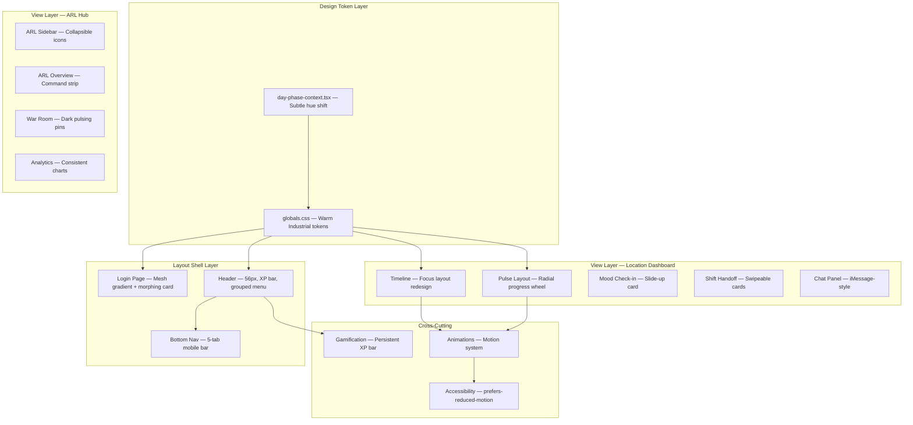
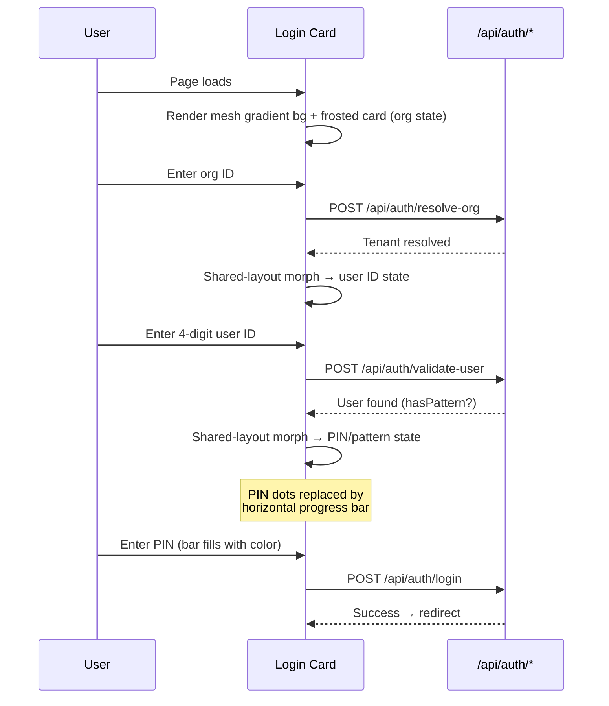
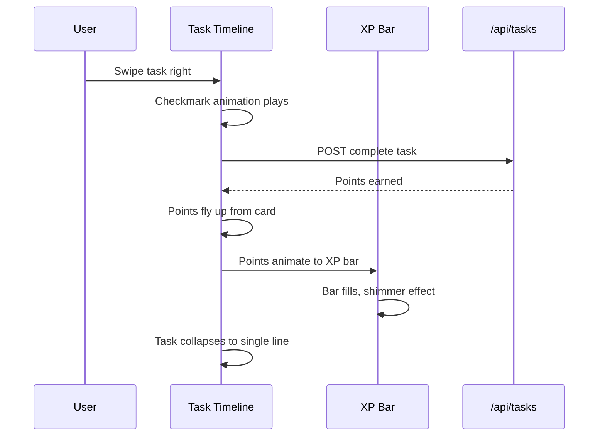
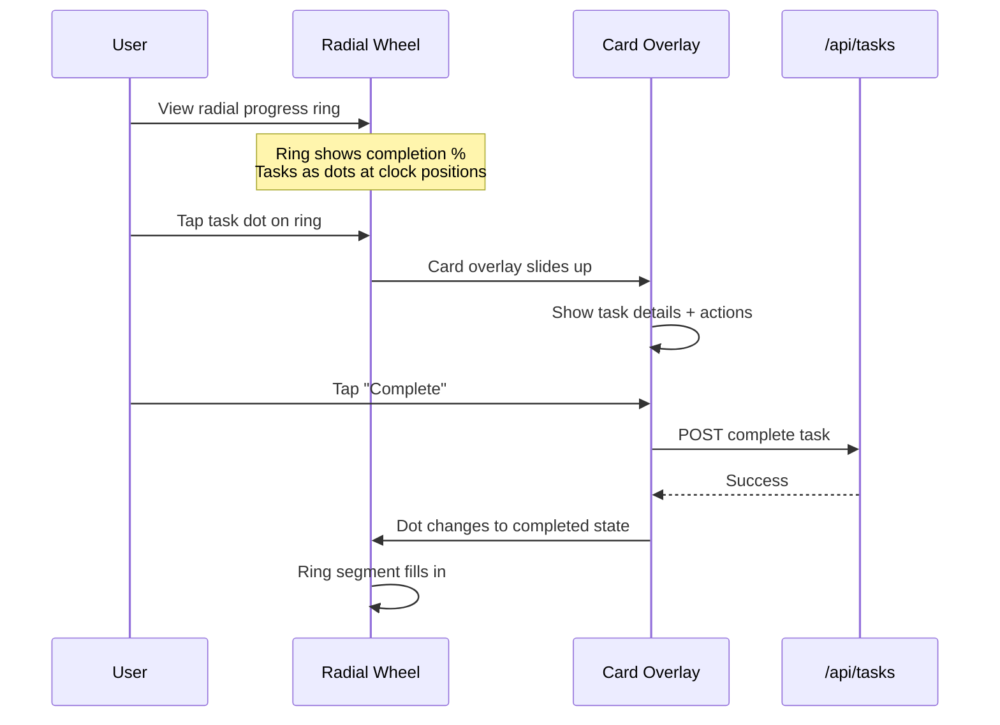

# Design Document — Hub Redesign: The Shift

## Overview

This document defines the comprehensive UI/UX redesign of The Hub franchise restaurant management dashboard. The redesign — codenamed "The Shift" — finds the middle ground between the original sterile interface and the overly spectacular "Dream" version. The guiding aesthetic is "Warm Industrial": an app that feels alive without being distracting.

The redesign is purely visual/interaction-layer. No new database tables, no new API routes, no new features. Every component referenced already exists in the codebase. This spec describes how each component's presentation, animation, and layout changes to align with the new design language.

The existing stack remains: Next.js 16, TypeScript, TailwindCSS v4, Drizzle ORM, Framer Motion, Socket.IO, LiveKit. Dark mode is the primary design target.

---

## Architecture

The redesign touches four architectural layers without changing the data or API layers:



---

## Sequence Diagrams

### Login Flow — Morphing Card States



### Task Completion — Focus Layout



### Pulse Layout — Radial Wheel Interaction



---

## Components and Interfaces

### Component 1: Design Token System (globals.css)

**Purpose**: Establish the "Warm Industrial" visual language as CSS custom properties.

**Interface**:
```typescript
// New CSS custom properties added to :root and .dark
interface WarmIndustrialTokens {
  // Background shifts subtly with time of day
  '--bg-base-h': string;      // hue: 220 (night) → 35 (dawn)
  '--bg-base-s': string;      // saturation: 15% (night) → 10% (dawn)
  '--bg-base-l': string;      // lightness: 10% (night) → 12% (dawn)

  // Card treatment — frosted glass
  '--card-bg': 'rgba(255,255,255,0.05)';
  '--card-blur': '24px';       // backdrop-blur-xl
  '--card-border': 'rgba(255,255,255,0.1)';

  // Accent palette
  '--hub-red': '#e4002b';      // unchanged, used sparingly
  '--warm-amber': '#d97706';
  '--slate-blue': '#64748b';
  '--muted-green': '#059669';

  // Typography weight bump
  '--font-weight-header': '900';  // font-black
  '--font-weight-body': '500';    // font-medium
}
```

**Responsibilities**:
- Define dark mode as primary (true blacks + warm-tinted cards)
- Define light mode as secondary (warm off-whites + subtle shadows)
- Provide time-of-day hue rotation via CSS custom properties updated by DayPhaseProvider
- Keep `--hub-red` as accent only: active states, urgent badges, logo

### Component 2: Login Page Redesign (src/app/login/page.tsx)

**Purpose**: Replace the current flat gradient login with an animated mesh gradient and morphing card states.

**Interface**:
```typescript
interface LoginPageRedesign {
  // Background: animated mesh gradient (not particles)
  background: 'mesh-gradient';

  // Single frosted card that morphs between states
  cardStates: ['org', 'userId', 'pin-or-pattern'];
  cardTransition: 'shared-layout-animation';  // Framer Motion layoutId

  // PIN entry: horizontal bar instead of dots
  pinIndicator: 'progress-bar';  // fills left-to-right with brand color
  pinHaptic: boolean;            // micro-haptic per digit

  // Session code: integrated footer strip
  sessionCodePosition: 'card-footer';

  // Constellation grid: subtle glow trail, nodes pulse on hover
  constellationEnhancements: {
    glowTrail: boolean;
    hoverPulse: boolean;
  };
}
```

**Responsibilities**:
- Render full-bleed animated CSS mesh gradient background (using `@property` for animatable gradients)
- Morph a single frosted-glass card between org → userId → PIN/pattern states using Framer Motion `layoutId`
- Replace PIN dot indicators with a horizontal progress bar that fills with `--hub-red`
- Move session code from top-right corner to an integrated footer strip at the bottom of the card
- Enhance constellation grid with subtle glow trails and hover pulse effects

### Component 3: Header Redesign (src/components/dashboard/minimal-header.tsx)

**Purpose**: Expand the header from 48px to 56px, add live clock with food safety indicator, persistent XP bar, and grouped Hub Menu.

**Interface**:
```typescript
interface HeaderRedesign {
  height: '56px';  // up from 48px

  left: {
    logo: 'rounded-square-gradient';  // "H" with gradient bg
    storeName: 'always-visible';
    storeNumber: 'always-visible';
  };

  center: {
    clock: 'live-clock';
    colorIndicator: 'food-safety-dot';  // replaces separate color expiry toast
  };

  right: {
    iconSize: '40px';
    iconHoverBg: 'circle';
    gamificationTrigger: 'xp-bar';
  };

  xpBar: {
    height: '3px';
    position: 'under-header-full-width';
    persistent: true;
  };

  hubMenu: {
    animation: 'slide-down';
    sections: ['Display', 'Shift', 'Account'];
    dividers: true;
  };
}
```

**Responsibilities**:
- Render at 56px height with frosted glass treatment
- Left section: "H" logo as rounded square with gradient, store name + number always visible
- Center section: Live clock with color-coded food safety indicator dot
- Right section: 40px touch target icons with circular hover backgrounds
- Persistent 3px XP bar spanning full width under header
- Hub Menu slides down with grouped sections and dividers

### Component 4: Task Timeline Redesign (src/components/dashboard/timeline.tsx)

**Purpose**: Redesign the Focus layout task list with left-edge color stripes, swipe-to-complete, sticky time headers, and current-time indicator.

**Interface**:
```typescript
interface TimelineRedesign {
  // Left-edge color stripe instead of full background tinting
  statusStripe: {
    width: '4px';
    position: 'left-edge';
    colors: {
      overdue: 'red-500';
      dueSoon: 'amber-500';
      completed: 'emerald-500';
      pending: 'slate-400';
    };
    overdueAnimation: 'subtle-pulse';  // pulse on stripe only
  };

  // Swipe-to-complete gesture
  swipeToComplete: {
    direction: 'right';
    animation: 'checkmark + points-fly-up';
    accessibilityFallback: 'button';
  };

  // Sticky time grouping headers
  timeHeaders: {
    sticky: true;
    showTaskCount: true;
  };

  // Current-time indicator
  currentTimeIndicator: {
    style: 'thin-horizontal-line';
    pill: 'time-pill';
    animation: 'smooth-scroll';
  };

  // Completed tasks collapse
  completedCollapse: 'single-line-title-checkmark';
}
```

**Responsibilities**:
- Replace full-row background tinting with a 4px left-edge color stripe per task
- Implement swipe-right-to-complete gesture with checkmark animation and points fly-up
- Provide button fallback for accessibility (keyboard/screen reader users)
- Render sticky time grouping headers with task counts
- Animate a thin horizontal current-time indicator line with time pill
- Collapse completed tasks to a single line showing title + checkmark

### Component 5: Pulse Layout Redesign (src/components/dashboard/pulse-layout.tsx)

**Purpose**: Replace floating orbs with a radial progress wheel showing completion percentage and task positions.

**Interface**:
```typescript
interface PulseLayoutRedesign {
  // Radial progress wheel
  progressWheel: {
    shape: 'circular-ring';
    segments: 'per-time-block';
    completionPercentage: 'center-large-number';
    statusWord: 'one-word-below-number';  // "Crushing" / "Behind" / "Steady"
  };

  // Tasks as dots on ring
  taskDots: {
    position: 'clock-face-scheduled-time';
    interaction: 'tap-to-card-overlay';
    completedStyle: 'filled-dot';
    overdueStyle: 'pulsing-red-dot';
  };

  // Health score in center
  centerDisplay: {
    primaryNumber: 'health-score';
    statusWord: 'one-word-status';
  };

  // Background
  background: {
    dayPhase: 'gentle-color-wash';
    particles: 'none';  // no particles in redesign
  };
}
```

**Responsibilities**:
- Render a large circular SVG ring showing completion percentage with segments per time block
- Position task dots on the ring at their scheduled time (clock face metaphor)
- Display health score as a large number in the center with a one-word status
- Tap on a task dot opens a card overlay with task details
- Use gentle day-phase color wash background, no particles

### Component 6: Bottom Navigation (new component)

**Purpose**: Provide a 5-tab mobile bottom navigation bar for the location dashboard.

**Interface**:
```typescript
interface BottomNavigation {
  tabs: ['Tasks', 'Chat', 'Mood', 'Calendar', 'Menu'];
  activeIndicator: 'filled-icon + dot';
  inactiveStyle: 'outlined-icon';
  treatment: 'frosted-glass';
  menuAction: 'open-hub-menu-as-bottom-sheet';
}
```

**Responsibilities**:
- Render a fixed bottom bar with 5 tabs on mobile viewports
- Active tab shows filled icon with dot indicator below
- Inactive tabs show outlined icons
- Apply frosted glass treatment matching card style
- "Menu" tab opens the Hub Menu as a bottom sheet

### Component 7: Chat Panel Redesign (src/components/dashboard/restaurant-chat.tsx)

**Purpose**: Redesign the chat interface with iMessage-style bubbles, typing indicators, and voice message waveforms.

**Interface**:
```typescript
interface ChatPanelRedesign {
  mobile: 'full-screen-from-bottom-nav';
  desktop: 'resizable-panel-with-drag-handle';

  bubbles: {
    style: 'iMessage-rounded-except-sender-corner';
    sentColor: 'var(--hub-red)';
    receivedColor: 'frosted-glass';
  };

  typingIndicator: 'animated-dots';

  voiceMessages: {
    visualization: 'waveform';
  };

  conversationList: {
    avatars: 'circles-with-initials';
    colorCoding: 'by-conversation-type';
  };
}
```

### Component 8: ARL Sidebar Redesign (src/components/arl/arl-sidebar.tsx)

**Purpose**: Collapse sidebar to icons-only by default, expand on hover.

**Interface**:
```typescript
interface ArlSidebarRedesign {
  defaultState: 'collapsed-icons-only';
  expandTrigger: 'hover';
  collapsedWidth: '64px';
  expandedWidth: '260px';
  transition: 'smooth-200ms';
}
```

### Component 9: ARL Overview Redesign (src/components/arl/overview-dashboard.tsx)

**Purpose**: Replace the current overview with a "command strip" horizontal bar and location list as primary view.

**Interface**:
```typescript
interface ArlOverviewRedesign {
  commandStrip: {
    layout: 'horizontal-bar';
    metrics: ['onlineCount', 'overdueCount', 'completionPct', 'totalPoints'];
    sparklines: true;
  };

  locationList: {
    primary: true;
    healthBars: 'thin-colored-bar';
    expandable: 'inline-task-list-activity-mirror';
  };
}
```

### Component 10: Gamification System (src/components/dashboard/gamification-hub.tsx)

**Purpose**: Make XP bar always visible under header, redesign profile/badge/leaderboard views.

**Interface**:
```typescript
interface GamificationRedesign {
  xpBar: {
    position: 'under-header-full-width';
    height: '3px';
    alwaysVisible: true;
    tapAction: 'open-profile';
  };

  profile: {
    mobile: 'full-screen';
    desktop: 'wider-panel';
    content: ['level-progress', 'streak-calendar', 'badge-grid', 'leaderboard'];
  };

  streakCalendar: 'github-style-contribution-grid';

  badgeUnlock: {
    animation: '2-second-fullscreen-radial-burst';
  };

  leaderboard: {
    avatars: 'colored-circles';
    positionChanges: 'animated';
  };
}
```

### Component 11: Shift Handoff Redesign (src/components/dashboard/shift-handoff.tsx)

**Purpose**: Replace auto-advancing phases with swipeable card stack.

**Interface**:
```typescript
interface ShiftHandoffRedesign {
  layout: 'swipeable-card-stack';
  gotItButton: 'always-visible-bottom';
  background: 'muted-shift-period-gradient';
  autoAdvance: false;  // user swipes manually
}
```

### Component 12: Mood Check-in Redesign (src/components/dashboard/mood-checkin.tsx)

**Purpose**: Replace blocking modal with a slide-up card from bottom.

**Interface**:
```typescript
interface MoodCheckinRedesign {
  trigger: 'slide-up-card-from-bottom';
  timing: '5-min-after-login';
  blocking: false;  // not a modal
  emojiSize: '64px';
  emojiLabels: true;
  dismissBehavior: {
    firstDismiss: 'reappear-after-30-min';
    secondDismiss: 'give-up';
  };
  completionAnimation: 'thank-you-slide-down';
}
```

---

## Data Models

No new data models are introduced. The redesign operates on existing schema tables and API responses. The visual layer consumes the same data contracts.

### Design Token Model (CSS Custom Properties)

```typescript
// Time-of-day background hue rotation
// Updated by DayPhaseProvider every minute
interface TimeOfDayTokens {
  night:   { h: 220, s: 15, l: 10 };  // hsl(220, 15%, 10%)
  dawn:    { h: 35,  s: 10, l: 12 };  // hsl(35, 10%, 12%)
  morning: { h: 200, s: 12, l: 11 };  // hsl(200, 12%, 11%)
  midday:  { h: 210, s: 10, l: 12 };  // hsl(210, 10%, 12%)
  evening: { h: 240, s: 14, l: 11 };  // hsl(240, 14%, 11%)
}

// Card frosted glass treatment — applied globally
const CARD_STYLE = {
  background: 'bg-white/5',
  backdropFilter: 'backdrop-blur-xl',
  border: 'border border-white/10',
} as const;
```

### Validation Rules

- XP bar height must be exactly 3px
- Header height must be exactly 56px
- Touch targets must be ≥ 40px (icons) or ≥ 64px (primary actions)
- Animation durations: page transitions 200ms, card press scale(0.98), list stagger 30ms
- `prefers-reduced-motion`: all animations become instant state changes

---


## Key Functions with Formal Specifications

### Function 1: computeBackgroundHSL(phase, hour, minute)

```typescript
function computeBackgroundHSL(
  phase: DayPhase,
  hour: number,
  minute: number
): { h: number; s: number; l: number }
```

**Preconditions:**
- `phase` is one of: 'dawn' | 'morning' | 'midday' | 'afternoon' | 'evening' | 'night'
- `hour` is integer 0–23
- `minute` is integer 0–59

**Postconditions:**
- Returns HSL values where h ∈ [0, 360], s ∈ [0, 100], l ∈ [0, 100]
- Transition between phases is interpolated linearly over the phase boundary hour
- The shift is barely noticeable: max delta between adjacent phases is ≤ 30 hue degrees

**Loop Invariants:** N/A

### Function 2: renderRadialWheel(tasks, currentTime, containerSize)

```typescript
function renderRadialWheel(
  tasks: TaskItem[],
  currentTime: Date,
  containerSize: number
): SVGElement
```

**Preconditions:**
- `tasks` is a non-empty array of TaskItem objects with `dueTime` (HH:mm string)
- `currentTime` is a valid Date
- `containerSize` is a positive number ≥ 200

**Postconditions:**
- Returns an SVG element containing a circular ring with radius = containerSize / 2 - padding
- Each task is positioned on the ring at angle = (dueHour * 60 + dueMinute) / (24 * 60) * 360
- Completed segments are filled with emerald, pending with slate, overdue with red
- Center displays health score as large text + one-word status

**Loop Invariants:**
- For each task placed on the ring: its angular position corresponds to its dueTime

### Function 3: handleSwipeToComplete(taskId, swipeDistance, threshold)

```typescript
function handleSwipeToComplete(
  taskId: string,
  swipeDistance: number,
  threshold: number
): { shouldComplete: boolean; animationState: 'idle' | 'swiping' | 'completing' }
```

**Preconditions:**
- `taskId` is a non-empty string referencing an existing task
- `swipeDistance` is a number ≥ 0 (pixels swiped right)
- `threshold` is a positive number (typically ~120px)

**Postconditions:**
- If `swipeDistance >= threshold`: returns `{ shouldComplete: true, animationState: 'completing' }`
- If `swipeDistance < threshold`: returns `{ shouldComplete: false, animationState: 'swiping' }`
- When completing: triggers checkmark animation → points fly up → task collapses
- Accessibility: button fallback triggers same completion flow without swipe

**Loop Invariants:** N/A

### Function 4: morphLoginCard(fromState, toState)

```typescript
function morphLoginCard(
  fromState: 'org' | 'userId' | 'pin' | 'pattern',
  toState: 'org' | 'userId' | 'pin' | 'pattern'
): FramerMotionTransition
```

**Preconditions:**
- `fromState` !== `toState`
- Valid transitions: org→userId, userId→pin, userId→pattern, pin→userId (back), pattern→userId (back)

**Postconditions:**
- Returns a Framer Motion shared-layout animation config
- Card dimensions morph smoothly (height changes for pattern vs PIN)
- Content cross-fades within the card shell
- Card border-radius and frosted glass treatment remain constant during morph

**Loop Invariants:** N/A

---

## Algorithmic Pseudocode

### Main Processing Algorithm: Time-of-Day Background Shift

```typescript
// Runs in DayPhaseProvider, updates CSS custom properties every 60 seconds
const PHASE_HSL: Record<DayPhase, { h: number; s: number; l: number }> = {
  night:     { h: 220, s: 15, l: 10 },
  dawn:      { h: 35,  s: 10, l: 12 },
  morning:   { h: 200, s: 12, l: 11 },
  midday:    { h: 210, s: 10, l: 12 },
  afternoon: { h: 220, s: 12, l: 11 },
  evening:   { h: 240, s: 14, l: 11 },
};

function updateBackgroundHue(phase: DayPhase): void {
  const target = PHASE_HSL[phase];
  const root = document.documentElement;
  // CSS transition handles the smooth interpolation
  root.style.setProperty('--bg-base-h', String(target.h));
  root.style.setProperty('--bg-base-s', `${target.s}%`);
  root.style.setProperty('--bg-base-l', `${target.l}%`);
}
// Background element uses: background: hsl(var(--bg-base-h), var(--bg-base-s), var(--bg-base-l))
// CSS transition: transition: background 3s ease
```

### Radial Progress Wheel Rendering

```typescript
function calculateTaskAngle(dueTime: string): number {
  // Convert HH:mm to angle on 12-hour clock face
  const [h, m] = dueTime.split(':').map(Number);
  const hour12 = h % 12;
  const totalMinutes = hour12 * 60 + m;
  // 0 degrees = 12 o'clock, clockwise
  return (totalMinutes / 720) * 360;
}

function renderWheelSegments(
  tasks: TaskItem[],
  completions: Set<string>
): WheelSegment[] {
  // Group tasks into time blocks (e.g., hourly)
  const blocks = groupByHour(tasks);
  return blocks.map(block => ({
    startAngle: calculateTaskAngle(block.startTime),
    endAngle: calculateTaskAngle(block.endTime),
    completionRatio: block.tasks.filter(t => completions.has(t.id)).length / block.tasks.length,
    color: block.tasks.some(t => isOverdue(t)) ? 'red' : 
           block.completionRatio === 1 ? 'emerald' : 'slate',
  }));
}
```

### Swipe-to-Complete Gesture Handler

```typescript
const SWIPE_THRESHOLD = 120; // pixels

function useSwipeToComplete(taskId: string, onComplete: (id: string) => void) {
  const [offsetX, setOffsetX] = useState(0);
  const [swiping, setSwiping] = useState(false);

  const handlers = {
    onPointerDown: (e: PointerEvent) => {
      setSwiping(true);
      e.currentTarget.setPointerCapture(e.pointerId);
    },
    onPointerMove: (e: PointerEvent) => {
      if (!swiping) return;
      const dx = Math.max(0, e.movementX + offsetX); // right only
      setOffsetX(dx);
    },
    onPointerUp: () => {
      setSwiping(false);
      if (offsetX >= SWIPE_THRESHOLD) {
        // Trigger completion animation then API call
        onComplete(taskId);
      }
      setOffsetX(0); // spring back
    },
  };

  return { offsetX, handlers, progress: Math.min(1, offsetX / SWIPE_THRESHOLD) };
}
```

### Hub Menu Grouped Sections

```typescript
const HUB_MENU_SECTIONS = [
  {
    label: 'Display',
    items: ['theme-toggle', 'layout-selector', 'screensaver-toggle'],
  },
  {
    label: 'Shift',
    items: ['sound-toggle', 'soundscape-intensity', 'hand-off-shift'],
  },
  {
    label: 'Account',
    items: ['connection-status', 'logout'],
  },
] as const;
```

---

## Example Usage

### Frosted Glass Card (Global Pattern)

```typescript
// Before (current):
<div className="rounded-3xl bg-white/80 backdrop-blur-md shadow-2xl border border-white">

// After (Warm Industrial):
<div className="rounded-2xl bg-white/5 backdrop-blur-xl border border-white/10 shadow-lg">
```

### Header with XP Bar

```typescript
<header className="sticky top-0 flex h-14 items-center bg-white/5 backdrop-blur-xl border-b border-white/10 px-4 z-[100]">
  {/* Left: Logo + Store */}
  <div className="flex items-center gap-2">
    <div className="h-8 w-8 rounded-lg bg-gradient-to-br from-[var(--hub-red)] to-red-700 flex items-center justify-center">
      <span className="text-sm font-black text-white">H</span>
    </div>
    <div>
      <p className="text-xs font-black text-foreground">{storeName}</p>
      <p className="text-[10px] text-muted-foreground">#{storeNumber}</p>
    </div>
  </div>

  {/* Center: Live Clock + Food Safety Dot */}
  <div className="flex-1 flex justify-center">
    <div className="flex items-center gap-2">
      <span className="text-sm font-black tabular-nums">{displayTime}</span>
      <div className={cn("h-2 w-2 rounded-full", foodSafetyColor)} />
    </div>
  </div>

  {/* Right: Action Icons */}
  <div className="flex items-center gap-1">
    {/* 40px touch targets with circular hover */}
    <button className="h-10 w-10 flex items-center justify-center rounded-full hover:bg-white/10 transition-colors">
      <MessageCircle className="h-[18px] w-[18px]" />
    </button>
  </div>
</header>

{/* XP Bar — 3px, full width, under header */}
<div className="h-[3px] w-full bg-white/5">
  <motion.div
    className="h-full bg-gradient-to-r from-amber-500 to-amber-400"
    style={{ width: `${xpProgress}%` }}
    transition={{ type: 'spring', stiffness: 100, damping: 20 }}
  />
</div>
```

### Task Timeline Item with Left Stripe

```typescript
<motion.div
  className="relative flex items-center gap-3 rounded-xl bg-white/5 backdrop-blur-xl border border-white/10 p-3 overflow-hidden"
  whileTap={{ scale: 0.98 }}
  // Swipe handler
  drag="x"
  dragConstraints={{ left: 0, right: 150 }}
  onDragEnd={(_, info) => {
    if (info.offset.x > SWIPE_THRESHOLD) onComplete(task.id);
  }}
>
  {/* Left color stripe */}
  <div className={cn(
    "absolute left-0 top-0 bottom-0 w-1",
    task.isOverdue && "bg-red-500 animate-pulse",
    task.isDueSoon && "bg-amber-500",
    task.isCompleted && "bg-emerald-500",
    !task.isOverdue && !task.isDueSoon && !task.isCompleted && "bg-slate-400",
  )} />

  {/* Task content */}
  <div className="flex-1 pl-2">
    <p className="text-sm font-medium">{task.title}</p>
    <p className="text-xs text-muted-foreground">{task.dueTime}</p>
  </div>
</motion.div>
```

### Bottom Navigation (Mobile)

```typescript
<nav className="fixed bottom-0 inset-x-0 h-16 bg-white/5 backdrop-blur-xl border-t border-white/10 flex items-center justify-around px-2 z-[100] sm:hidden">
  {[
    { id: 'tasks', icon: ClipboardList, label: 'Tasks' },
    { id: 'chat', icon: MessageCircle, label: 'Chat' },
    { id: 'mood', icon: Smile, label: 'Mood' },
    { id: 'calendar', icon: CalendarDays, label: 'Calendar' },
    { id: 'menu', icon: Menu, label: 'Menu' },
  ].map(tab => (
    <button
      key={tab.id}
      className="flex flex-col items-center gap-0.5 py-1"
      onClick={() => handleTabChange(tab.id)}
    >
      <tab.icon className={cn(
        "h-5 w-5",
        activeTab === tab.id ? "text-foreground fill-current" : "text-muted-foreground"
      )} />
      {activeTab === tab.id && (
        <motion.div layoutId="tab-dot" className="h-1 w-1 rounded-full bg-[var(--hub-red)]" />
      )}
      <span className="text-[10px]">{tab.label}</span>
    </button>
  ))}
</nav>
```

---

## Correctness Properties

*A property is a characteristic or behavior that should hold true across all valid executions of a system — essentially, a formal statement about what the system should do. Properties serve as the bridge between human-readable specifications and machine-verifiable correctness guarantees.*

### Property 1: Dark mode lightness invariant

*For any* valid DayPhase, the computed background lightness value from `computeBackgroundHSL` is between 10 and 12 inclusive, ensuring dark mode always stays dark.

**Validates: Requirements 2.7**

### Property 2: Adjacent phase hue delta bound

*For any* pair of adjacent DayPhases in the phase cycle, the absolute hue difference between them is at most 30 degrees, ensuring transitions are barely noticeable.

**Validates: Requirements 2.8**

### Property 3: Task dot angular position

*For any* task with a valid dueTime (HH:mm), the dot's angular position on the radial wheel equals `(dueHour % 12 * 60 + dueMinute) / 720 * 360` degrees, and the result is between 0 and 360.

**Validates: Requirements 6.2**

### Property 4: Swipe threshold completion

*For any* swipe distance value, if `swipeDistance >= SWIPE_THRESHOLD` (120px) then `shouldComplete` is true and the task completion API is called exactly once; if `swipeDistance < SWIPE_THRESHOLD` then `shouldComplete` is false and no API call is made.

**Validates: Requirements 5.6**

### Property 5: Swipe gesture disambiguation

*For any* initial pointer movement vector, if the horizontal component is less than 60% of the total movement magnitude, the gesture is treated as vertical scroll and swipe-to-complete does not activate.

**Validates: Requirements 5.11**

### Property 6: Login card border-radius invariant

*For any* login card state (org, userId, pin, pattern), the card's border-radius remains constant at rounded-2xl and the Frosted_Glass treatment is applied, regardless of which state the card is in or transitioning between.

**Validates: Requirements 3.4**

### Property 7: Login card state machine validity

*For any* login card state transition, only valid transitions are permitted: org→userId, userId→pin, userId→pattern, pin→userId (back), pattern→userId (back). All other transitions are rejected.

**Validates: Requirements 3.9, 3.10**

### Property 8: Task stripe color mapping

*For any* task, the left-edge stripe color is determined solely by its status: overdue→red-500, dueSoon→amber-500, completed→emerald-500, pending→slate-400. No other color is assigned.

**Validates: Requirements 5.2, 5.3, 5.4, 5.5**

### Property 9: Completed task collapse

*For any* completed task in the Focus layout, the rendered output is a single line containing only the task title and a checkmark, not a full card.

**Validates: Requirements 5.10**

### Property 10: Sticky header task counts

*For any* time grouping in the Task Timeline, the sticky header displays a task count that equals the actual number of tasks in that time block.

**Validates: Requirements 5.8**

### Property 11: Reduced motion disables animations

*For any* animation in the system, when `prefers-reduced-motion` is enabled, the animation duration is 0ms and no transform animations play.

**Validates: Requirements 14.1**

### Property 12: Touch target minimum dimensions

*For any* interactive element, icon touch targets are at least 40px in both dimensions, and primary action button touch targets are at least 64px. This applies across Header icons, Bottom_Nav tabs, and the Shift_Handoff "Got It" button.

**Validates: Requirements 14.3, 14.4, 14.5, 4.6**

### Property 13: Bottom nav tab icon state

*For any* tab in the Bottom_Nav, if the tab is active then its icon is filled with a dot indicator below; if the tab is inactive then its icon is outlined without a dot. These two states are mutually exclusive and exhaustive.

**Validates: Requirements 7.3, 7.4**

### Property 14: Hub Menu section ordering

*For any* rendering of the Hub_Menu, sections are always grouped in the order Display → Shift → Account with dividers between each section.

**Validates: Requirements 4.11**

### Property 15: Radial wheel dot status rendering

*For any* task on the Radial_Wheel, if the task is completed then its dot is rendered as filled with an emerald segment; if the task is overdue then its dot is rendered as pulsing red. Status determines rendering.

**Validates: Requirements 6.5, 6.6**

### Property 16: Mood check-in dismiss behavior

*For any* session, the Mood_Checkin dismiss count determines reappearance: first dismiss causes reappearance after 30 minutes, second dismiss suppresses the check-in for the remainder of the session.

**Validates: Requirements 13.4, 13.5**

### Property 17: Shift handoff no auto-advance

*For any* shift handoff card stack, without user interaction (swipe), the visible card does not change over time. The stack only advances when the user explicitly swipes.

**Validates: Requirements 12.4**

---

## Error Handling

### Error Scenario 1: Mesh Gradient Not Supported

**Condition**: Browser doesn't support CSS `@property` or `mesh-gradient`
**Response**: Fall back to a simple radial gradient with the same base HSL values
**Recovery**: Feature detection via `CSS.supports()` at mount time

### Error Scenario 2: Swipe Gesture Conflict

**Condition**: User swipes on a task but the gesture conflicts with page scroll
**Response**: Only activate horizontal swipe when initial movement is >60% horizontal
**Recovery**: If gesture is ambiguous, default to scroll (vertical wins)

### Error Scenario 3: Radial Wheel Overflow

**Condition**: More than 30 tasks need to be placed on the radial wheel
**Response**: Group nearby tasks into cluster dots with count badges
**Recovery**: Tap on cluster expands to show individual tasks in a list overlay

### Error Scenario 4: XP Bar Data Unavailable

**Condition**: Gamification API fails to return XP data
**Response**: XP bar renders at 0% with no animation, no error shown to user
**Recovery**: Retry on next socket event or 30-second interval

---

## Testing Strategy

### Unit Testing Approach

- Test `computeBackgroundHSL` for all 6 phases: verify HSL values are within expected ranges
- Test `calculateTaskAngle` for edge cases: midnight (0°), noon (180°), 6am (90°), 6pm (270°)
- Test swipe threshold logic: below threshold returns idle, at/above returns completing
- Test Hub Menu section grouping: verify items are in correct sections
- Test bottom nav tab state: active/inactive icon rendering

### Property-Based Testing Approach

**Property Test Library**: fast-check

- For any valid DayPhase, background lightness is always between 10–12%
- For any task with a valid dueTime, the calculated angle is between 0–360°
- For any swipe distance ≥ 0, the progress value is between 0–1
- For any number of tasks 1–100, the radial wheel renders without overlapping center text

### Integration Testing Approach

- Login flow: verify card morphs correctly through all 3 states (org → userId → PIN)
- Task completion: verify swipe triggers API call, XP bar updates, task collapses
- Bottom nav: verify tab switching renders correct view content
- Hub Menu: verify grouped sections render with dividers, all actions work
- `prefers-reduced-motion`: verify all animations are disabled across all components

---

## Performance Considerations

- **Mesh gradient**: Use CSS `@property` with `will-change: background` for GPU-composited gradient animation
- **Radial wheel SVG**: Limit to 30 visible task dots; cluster overflow. SVG is lightweight for this node count.
- **Swipe gestures**: Use `pointer-capture` for smooth tracking without layout thrashing
- **XP bar**: Single `transform: scaleX()` animation, GPU-composited, no reflow
- **Background hue shift**: CSS custom property update triggers only repaint, not reflow
- **Bottom nav**: Fixed position with `will-change: transform` for smooth scroll behavior
- **Card morphs**: Framer Motion `layoutId` uses FLIP technique — measures once, animates with transforms only
- **List stagger**: 30ms stagger with `transform` + `opacity` only — no layout properties animated

---

## Security Considerations

No new security surface. The redesign is purely presentational. All existing auth, CSRF, rate limiting, and tenant scoping remain unchanged.

---

## Dependencies

No new dependencies. The redesign uses only what's already in the project:

- `framer-motion` — shared-layout animations, spring physics, gesture handling
- `tailwindcss` v4 — utility classes, CSS custom properties, `@property` support
- `@phosphor-icons/react` — icon set (filled + outlined variants for bottom nav)
- `recharts` — chart styling updates for ARL analytics
- `next-themes` — dark/light mode switching (dark is now primary)

---

## Appendix: Component-to-File Mapping

| Redesigned Component | Existing File | Change Type |
|---|---|---|
| Design Tokens | `src/app/globals.css` | Modify CSS variables |
| Background Hue Shift | `src/lib/day-phase-context.tsx` | Extend with HSL updates |
| Login Page | `src/app/login/page.tsx` | Major rewrite |
| Header | `src/components/dashboard/minimal-header.tsx` | Major rewrite |
| Task Timeline | `src/components/dashboard/timeline.tsx` | Major rewrite |
| Pulse Layout | `src/components/dashboard/pulse-layout.tsx` | Major rewrite |
| Bottom Navigation | `src/components/dashboard/bottom-nav.tsx` | New file |
| Chat Panel | `src/components/dashboard/restaurant-chat.tsx` | Moderate rewrite |
| ARL Sidebar | `src/components/arl/arl-sidebar.tsx` | Moderate rewrite |
| ARL Overview | `src/components/arl/overview-dashboard.tsx` | Moderate rewrite |
| War Room | `src/components/arl/war-room-map.tsx` | Style updates |
| Analytics | `src/components/arl/analytics-dashboard.tsx` | Style updates |
| Gamification Hub | `src/components/dashboard/gamification-hub.tsx` | Major rewrite |
| Shift Handoff | `src/components/dashboard/shift-handoff.tsx` | Moderate rewrite |
| Mood Check-in | `src/components/dashboard/mood-checkin.tsx` | Moderate rewrite |
| Heartbeat | `src/components/dashboard/heartbeat.tsx` | Style updates |
| Task Orbs | `src/components/dashboard/task-orbs.tsx` | Replaced by radial wheel |
| Constellation Grid | `src/components/auth/constellation-grid.tsx` | Enhancement |
| Celebrations | `src/components/dashboard/celebrations.tsx` | Style updates |
| Leaderboard | `src/components/dashboard/leaderboard.tsx` | Style updates |

---

## Appendix: Animation Specification

| Animation | Duration | Easing | Properties |
|---|---|---|---|
| Page transition | 200ms | ease | opacity (cross-fade) |
| Card press | 150ms | spring | scale(0.98) → scale(1) |
| List item stagger | 30ms per item | ease-out | opacity + translateY(8px → 0) |
| Task completion | 400ms | spring | checkmark scale + points translateY |
| Confetti burst | 1500ms | ease-out | particles from card position |
| Points fly to XP | 600ms | ease-in-out | translateX/Y to XP bar position |
| XP bar fill | 300ms | spring(100, 20) | width |
| Badge unlock | 2000ms | spring | radial burst + scale |
| Hub Menu slide | 200ms | ease-out | translateY(-8px → 0) + opacity |
| Bottom sheet | 300ms | spring(300, 30) | translateY |
| Background hue | 3000ms | ease | HSL custom properties |
| Overdue stripe pulse | 2000ms | ease-in-out | opacity 0.6 → 1 → 0.6 (infinite) |
| `prefers-reduced-motion` | 0ms | none | instant state change, no transforms |