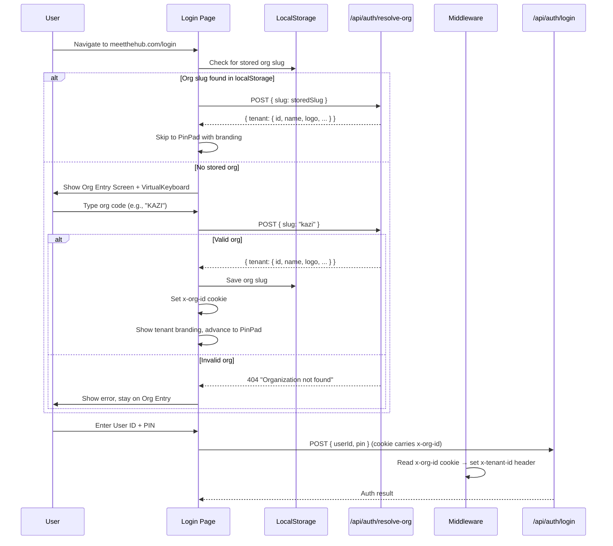
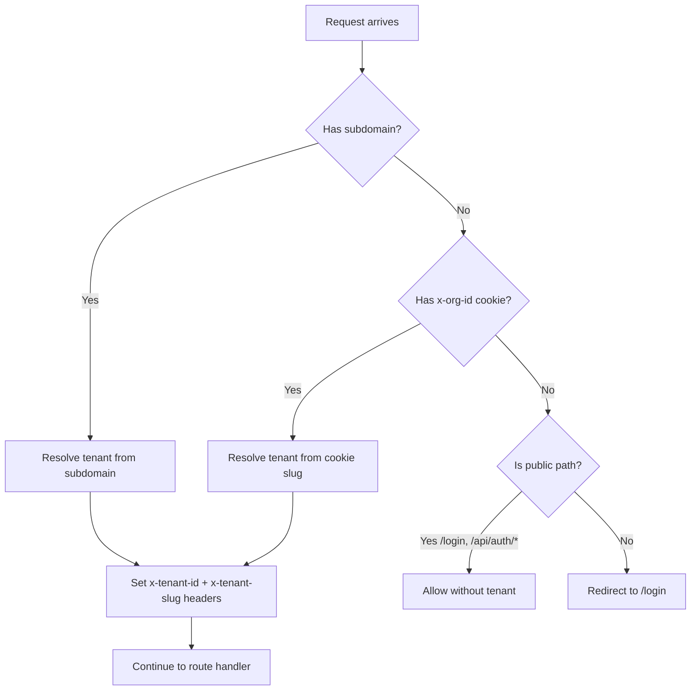

# Design Document: Organization ID Login

## Overview

This design adds an Organization ID entry step to the login page, replacing subdomain-based tenant resolution with a user-entered org code. Users visit `meetthehub.com` and type a short alphanumeric code (e.g., "KAZI") before seeing the PinPad. The existing `VirtualKeyboard` component is reused for kiosk environments. The resolved org is persisted in a cookie (for middleware) and localStorage (for client-side skip), with an optional IP-based association for fully hands-off kiosk setups.

### Key Design Decisions

- **Cookie over header for tenant context**: The middleware currently reads `x-tenant-id` from the subdomain. For non-subdomain flows, the login page sets an `x-org-id` cookie after validation. The middleware reads this cookie to resolve the tenant, keeping the same `x-tenant-id`/`x-tenant-slug` header injection pattern downstream.
- **New `/api/auth/resolve-org` endpoint**: A lightweight API that accepts an org slug, validates it against the tenants table (case-insensitive), and returns the tenant's branding info. This avoids exposing the full tenant record and allows rate-limiting independently.
- **Reuse existing `VirtualKeyboard`**: The keyboard already supports QWERTY + numbers + symbols with shift/caps lock. The org entry screen shows it by default (kiosk-first), with a toggle to hide it for physical keyboard users.
- **Backward compatibility**: Subdomain-based resolution continues to work. If a request arrives at `kazi.meetthehub.com`, the middleware resolves the tenant from the subdomain as before. The org entry screen only appears on the bare domain.
- **IP association as a separate phase**: Requirement 6 (IP-based org association) is designed as an opt-in feature with its own API and admin UI. It's decoupled from the core org entry flow so it can ship later without blocking.

## Architecture

### Login Flow with Org Entry



### Middleware Tenant Resolution (Updated)



## Components and Interfaces

### New API: `/api/auth/resolve-org`

```typescript
// POST /api/auth/resolve-org
// Request body:
interface ResolveOrgRequest {
  slug: string; // 2-10 alphanumeric characters, case-insensitive
}

// Success response (200):
interface ResolveOrgResponse {
  ok: true;
  tenant: {
    id: string;
    slug: string;
    name: string;
    logoUrl: string | null;
    primaryColor: string;
    accentColor: string | null;
    faviconUrl: string | null;
    appTitle: string | null;
  };
}

// Error response (404):
{ error: "Organization not found" }

// Rate limit response (429):
{ error: "Too many attempts", retryAfter: number }
```

Implementation details:
- Case-insensitive lookup: `slug.toLowerCase()` matched against `tenants.slug` (already lowercase in DB)
- Rate-limited: 10 attempts per IP per 60s window (reuses existing `checkRateLimit`)
- Only returns branding fields, not plan/features/limits
- Checks `isActive` — inactive tenants return 404

### Updated Login Page State Machine

The login page gains a new initial state `org-entry` before the existing flow:

```
org-entry → login-type-select → pin-entry → success
    ↑              ↓
    └── change-org ┘
```

New state variables added to `LoginPage`:
```typescript
const [orgSlug, setOrgSlug] = useState<string | null>(null);
const [orgInput, setOrgInput] = useState("");
const [orgError, setOrgError] = useState("");
const [orgLoading, setOrgLoading] = useState(false);
const [resolvedTenant, setResolvedTenant] = useState<ResolvedTenant | null>(null);
const [showOrgKeyboard, setShowOrgKeyboard] = useState(true); // default ON for kiosks
const [orgChecked, setOrgChecked] = useState(false); // tracks if initial localStorage check is done
```

### Org Entry Screen UI

The Org Entry Screen renders inside the existing `LoginPage` component as a new conditional block before the login type selection. It includes:

1. App branding (generic Hub logo + "Welcome to The Hub")
2. Text input for org code (uppercase, max 10 chars)
3. Toggle button for virtual keyboard (on by default)
4. `VirtualKeyboard` component (existing) — ENTER triggers submit
5. Error message area
6. Subtle "powered by The Hub" footer

The input field accepts both physical keyboard and virtual keyboard input. When the virtual keyboard is visible, the input is set to `readOnly` to prevent the native mobile keyboard from appearing (same pattern used in the guest mode flow).

### Cookie Management

After successful org resolution:
```typescript
// Set cookie for middleware to read
document.cookie = `x-org-id=${slug}; path=/; max-age=${60 * 60 * 24 * 365}; SameSite=Strict`;
// Also save to localStorage for faster client-side check on next visit
localStorage.setItem("hub-org-id", slug);
```

The "Change Organization" button:
```typescript
document.cookie = "x-org-id=; path=/; max-age=0";
localStorage.removeItem("hub-org-id");
setOrgSlug(null);
setResolvedTenant(null);
setLoginType(null);
setPin("");
```

### Middleware Changes (`src/middleware.ts`)

The middleware's root domain handler and tenant resolution logic are updated:

```typescript
// Current: Root domain → redirect everything to landing
// New: Root domain → allow /login and public paths, resolve tenant from cookie

if (isRootDomain(hostname)) {
  const orgCookie = request.cookies.get("x-org-id")?.value;
  
  // Allow landing page and static assets (unchanged)
  if (pathname === "/" || pathname.startsWith("/landing") || 
      pathname.startsWith("/_next") || pathname.includes(".")) {
    return applyCsp(NextResponse.next());
  }
  
  // If org cookie is set, resolve tenant and allow access
  if (orgCookie) {
    const tenant = resolveTenantBySlug(orgCookie);
    if (tenant) {
      const headers = new Headers(request.headers);
      headers.set("x-tenant-id", tenant.id);
      headers.set("x-tenant-slug", tenant.slug);
      
      // Same auth/routing logic as subdomain flow...
      // (public paths, token check, role-based redirects)
    }
  }
  
  // No org cookie → allow login page, redirect others to /login
  if (publicPaths.some(p => pathname.startsWith(p)) || 
      pathname.startsWith("/api/auth")) {
    return applyCsp(NextResponse.next());
  }
  return NextResponse.redirect(new URL("/login", request.url));
}
```

A new helper is added to `src/lib/tenant.ts`:

```typescript
export function resolveTenantBySlug(slug: string): { id: string; slug: string } | null {
  const row = db
    .select({ id: schema.tenants.id, slug: schema.tenants.slug })
    .from(schema.tenants)
    .where(eq(schema.tenants.slug, slug.toLowerCase()))
    .get();
  return row && row.id ? row : null;
}
```

### TenantProvider Update

The `TenantProvider` currently fetches from `/api/tenants/current`, which relies on `x-tenant-id` being set by middleware. On the root domain without a cookie, this returns null. The login page handles this by using the `resolvedTenant` from the org resolution API directly for branding, before the full `TenantProvider` context is available.

After the org cookie is set and the user navigates to `/dashboard` or `/arl`, the middleware resolves the tenant from the cookie, sets `x-tenant-id`, and the `TenantProvider` works as before.

### IP-Based Association (Requirement 6)

This is designed as a separate, opt-in feature:

New DB table:
```sql
CREATE TABLE org_ip_mappings (
  id TEXT PRIMARY KEY,
  tenant_id TEXT NOT NULL REFERENCES tenants(id),
  ip_address TEXT NOT NULL,
  created_by TEXT NOT NULL REFERENCES arls(id),
  created_at TEXT NOT NULL,
  UNIQUE(ip_address)
);
```

New API endpoints:
- `GET /api/auth/resolve-org-by-ip` — called by login page on load, returns org slug if IP is mapped
- `POST /api/admin/ip-mappings` — ARL/admin creates a mapping
- `DELETE /api/admin/ip-mappings/:id` — ARL/admin removes a mapping
- `GET /api/admin/ip-mappings` — list mappings for tenant

The login page checks IP association first, then localStorage, then shows the org entry screen. This is additive and doesn't change the core flow.

## Data Models

### Existing Tables (No Changes)

- `tenants` — the `slug` column is used as the Organization ID. No new columns needed.
- `locations` — `userId` + `tenantId` scoping already exists.
- `arls` — `userId` + `tenantId` scoping already exists.

### New Table: `org_ip_mappings` (Requirement 6 only)

| Column | Type | Description |
|--------|------|-------------|
| id | TEXT PK | UUID |
| tenant_id | TEXT FK→tenants.id | The tenant this IP maps to |
| ip_address | TEXT UNIQUE | IPv4 or IPv6 address |
| created_by | TEXT FK→arls.id | ARL who created the mapping |
| created_at | TEXT | ISO timestamp |

### Cookie: `x-org-id`

- Name: `x-org-id`
- Value: tenant slug (e.g., "kazi")
- Path: `/`
- Max-Age: 1 year (365 days)
- SameSite: Strict
- Secure: true in production

### localStorage Key: `hub-org-id`

- Key: `hub-org-id`
- Value: tenant slug (e.g., "kazi")
- Used for: fast client-side check to skip org entry on page load

## Error Handling

- **Invalid org slug format**: Client-side validation rejects empty or <2 char inputs before API call
- **Org not found**: API returns 404, login page shows "Organization not found" error inline
- **Inactive tenant**: API returns 404 (same as not found — no information leakage)
- **Rate limited**: API returns 429 with retry-after, login page shows "Too many attempts" message
- **Stale localStorage**: On page load, the stored slug is re-validated via API. If the tenant was deactivated, localStorage is cleared and the org entry screen appears
- **Stale cookie**: If the middleware can't resolve the cookie's slug to an active tenant, it treats the request as having no tenant context and redirects to `/login`
- **Network error during org resolution**: Login page shows "Connection error. Please try again." and stays on org entry screen

## Testing Strategy

### Unit Tests

- `resolveTenantBySlug` returns correct tenant for valid slug, null for invalid/inactive
- `resolve-org` API returns tenant branding for valid slug, 404 for invalid
- `resolve-org` API rate limits after 10 attempts
- Middleware resolves tenant from `x-org-id` cookie on root domain
- Middleware allows `/login` on root domain without cookie
- Middleware redirects protected routes to `/login` when no tenant context on root domain
- Cookie and localStorage are set after successful org resolution
- "Change Organization" clears cookie, localStorage, and resets state
